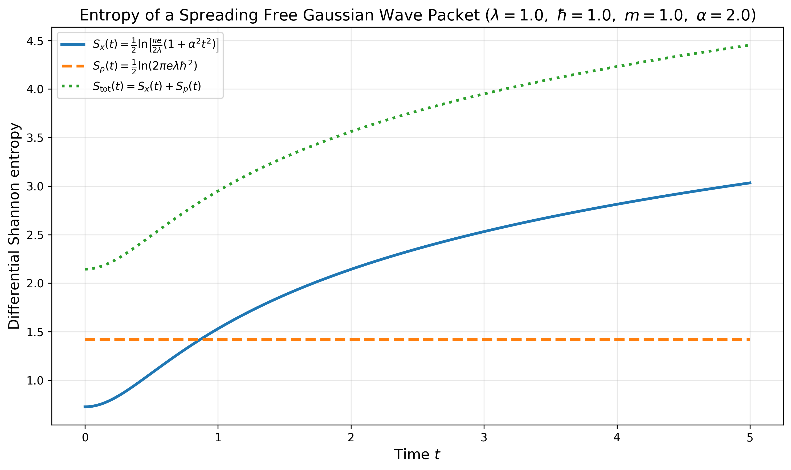
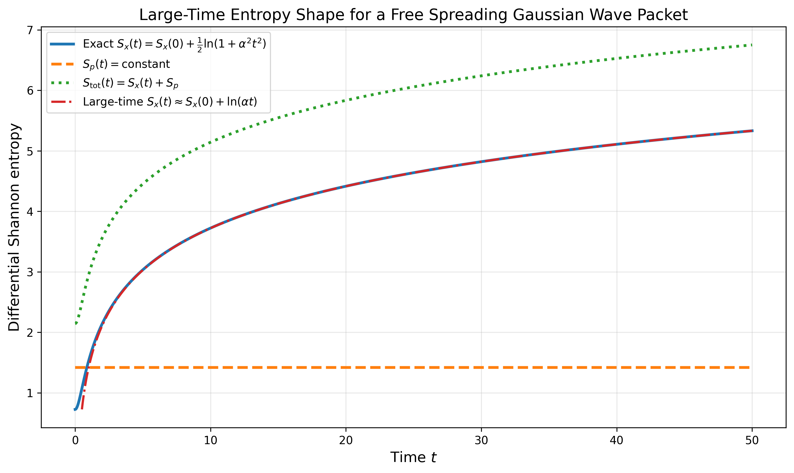

# Differential Shannon Entropy of Gaussian Wave Packets

This write-up collects the calculations I worked through for Gaussian wave packets and differential Shannon entropy. The goal is to make the derivation professor-review ready and GitHub-ready, with every important algebraic step shown clearly.

The entropy definition used here is the one used by Schürger and Engel for a continuous probability density:


```math
S(t)=-\int \rho(x,t)\ln \rho(x,t)\,dx.
```


For a wavefunction,


```math
\rho(x,t)=|\psi(x,t)|^2.
```


All logarithms are natural logarithms. Throughout the calculations, I use the standard physics convention where the variables are treated in a fixed unit system. Strictly, differential entropy for dimensional variables depends on the unit scale. In practice, this is usually handled by working in atomic units, natural units, or by comparing entropy differences rather than absolute values.

---

## Contents

1. [Stationary 1D Gaussian wave packet](#1-stationary-1d-gaussian-wave-packet)
2. [Free spreading Gaussian wave packet in position space](#2-free-spreading-gaussian-wave-packet-in-position-space)
3. [Free Gaussian wave packet in momentum space](#3-free-gaussian-wave-packet-in-momentum-space)
4. [Total position plus momentum entropy](#4-total-position-plus-momentum-entropy)
5. [Shape of the entropy curves](#5-shape-of-the-entropy-curves)
6. [Python visualization code](#6-python-visualization-code)
7. [How to run this project](#7-how-to-run-this-project)

---

# 1. Stationary 1D Gaussian wave packet

I first consider a stationary one-dimensional Gaussian wave packet of the form


```math
\psi(x)=\frac{1}{\pi^{1/4}\sigma^{1/2}}
\exp\left[-\frac{(x-x_0)^2}{2\sigma^2}\right]e^{ikx}.
```


Here:

- $x_0$ is the center of the packet.
- $\sigma$ controls the spatial width.
- $k$ is the average wave number.
- The phase factor $e^{ikx}$ does not affect the probability density.

The probability density is


```math
\rho(x)=|\psi(x)|^2.
```


Since


```math
|e^{ikx}|^2=1,
```


we get


```math
\rho(x)
=
\frac{1}{\sigma\sqrt{\pi}}
\exp\left[-\frac{(x-x_0)^2}{\sigma^2}\right].
```


The entropy is


```math
S_x=-\int_{-\infty}^{\infty}\rho(x)\ln\rho(x)\,dx.
```


First compute the logarithm:


```math
\ln\rho(x)
=
\ln\left[
\frac{1}{\sigma\sqrt{\pi}}
\exp\left(-\frac{(x-x_0)^2}{\sigma^2}\right)
\right].
```


Using


```math
\ln(AB)=\ln A+\ln B,
```


this becomes


```math
\ln\rho(x)
=
\ln\left(\frac{1}{\sigma\sqrt{\pi}}\right)
+
\ln\left[
\exp\left(-\frac{(x-x_0)^2}{\sigma^2}\right)
\right].
```


Since


```math
\ln(e^A)=A,
```


we have


```math
\ln\rho(x)
=
-\ln(\sigma\sqrt{\pi})
-
\frac{(x-x_0)^2}{\sigma^2}.
```


Now substitute into the entropy:


```math
S_x
=
-\int_{-\infty}^{\infty}
\rho(x)
\left[
-\ln(\sigma\sqrt{\pi})
-
\frac{(x-x_0)^2}{\sigma^2}
\right]dx.
```


Distribute the minus sign:


```math
S_x
=
\int_{-\infty}^{\infty}
\rho(x)\ln(\sigma\sqrt{\pi})\,dx
+
\int_{-\infty}^{\infty}
\rho(x)\frac{(x-x_0)^2}{\sigma^2}\,dx.
```


The first term is


```math
\ln(\sigma\sqrt{\pi})
\int_{-\infty}^{\infty}\rho(x)\,dx.
```


Because the probability density is normalized,


```math
\int_{-\infty}^{\infty}\rho(x)\,dx=1.
```


Therefore,


```math
\text{first term}=\ln(\sigma\sqrt{\pi}).
```


For the second term,


```math
\int_{-\infty}^{\infty}
\rho(x)\frac{(x-x_0)^2}{\sigma^2}\,dx
=
\frac{1}{\sigma^2}
\int_{-\infty}^{\infty}
(x-x_0)^2\rho(x)\,dx.
```


For this Gaussian density,


```math
\int_{-\infty}^{\infty}
(x-x_0)^2\rho(x)\,dx
=
\frac{\sigma^2}{2}.
```


So


```math
\text{second term}
=
\frac{1}{\sigma^2}\frac{\sigma^2}{2}
=
\frac12.
```


Therefore,


```math
S_x
=
\ln(\sigma\sqrt{\pi})+\frac12.
```


This is already a complete answer. It can also be written in a compact form. Since


```math
\frac12=\ln(e^{1/2}),
```


we can write


```math
S_x
=
\ln(\sigma\sqrt{\pi})+\ln(e^{1/2}).
```


Using


```math
\ln A+\ln B=\ln(AB),
```


we get


```math
S_x
=
\ln(\sigma\sqrt{\pi}\sqrt e).
```


Therefore,


```math
S_x
=
\ln(\sigma\sqrt{\pi e}).
```


Equivalently,


```math
\boxed{
S_x=\frac12\ln(\pi e\sigma^2).
}
```


The important point is that the $e$ appears only because the extra $+\frac12$ term can be written as a logarithm:


```math
\frac12=\ln(e^{1/2}).
```


For a stationary wave packet, $\sigma$ is constant, so


```math
\boxed{
S_x(t)=S_x(0)=\frac12\ln(\pi e\sigma^2).
}
```


---

# 2. Free spreading Gaussian wave packet in position space

Now I consider the free-particle Gaussian wave packet from the PHYS 4010 problem:


```math
\psi_0(x)
=
\left(\frac{2\lambda}{\pi}\right)^{1/4}e^{-\lambda x^2},
\qquad \lambda>0.
```


At later time $t>0$, the free-particle solution is


```math
\psi(x,t)
=
\left(\frac{2\lambda}{\pi}\right)^{1/4}
\frac{1}{\sqrt{1+i\alpha t}}
\exp\left[
-\frac{\lambda x^2}{1+i\alpha t}
\right],
```


where


```math
\alpha=\frac{2\hbar\lambda}{m}.
```


This result comes from applying the free-particle propagator to the initial Gaussian:


```math
\psi(x,t)=\int_{-\infty}^{\infty}K(x,t;x',0)\psi_0(x')\,dx',
```


with


```math
K(x,t;x',0)
=
\sqrt{\frac{m}{2\pi i\hbar t}}
\exp\left[
\frac{im(x-x')^2}{2\hbar t}
\right].
```


The propagator integral is a Gaussian integral. After completing the square and simplifying, the final result is the spreading Gaussian above.

---

## 2.1 Position-space density

We now calculate


```math
\rho(x,t)=|\psi(x,t)|^2.
```


Write


```math
\psi(x,t)
=
A
\frac{1}{\sqrt{1+i\alpha t}}
\exp\left[
-\frac{\lambda x^2}{1+i\alpha t}
\right],
```


where


```math
A=\left(\frac{2\lambda}{\pi}\right)^{1/4}.
```


Then


```math
|\psi(x,t)|^2
=
|A|^2
\left|
\frac{1}{\sqrt{1+i\alpha t}}
\right|^2
\left|
\exp\left[
-\frac{\lambda x^2}{1+i\alpha t}
\right]
\right|^2.
```


The first factor is


```math
|A|^2
=
\left(\frac{2\lambda}{\pi}\right)^{1/2}.
```


For the second factor,


```math
\left|
\frac{1}{\sqrt{1+i\alpha t}}
\right|^2
=
\frac{1}{|1+i\alpha t|}.
```


Since


```math
|1+i\alpha t|=\sqrt{1+\alpha^2t^2},
```


we get


```math
\left|
\frac{1}{\sqrt{1+i\alpha t}}
\right|^2
=
\frac{1}{\sqrt{1+\alpha^2t^2}}.
```


For the exponential factor, use


```math
|e^z|^2=e^{z+z^*}=e^{2\operatorname{Re}(z)}.
```


Here,


```math
z=-\frac{\lambda x^2}{1+i\alpha t}.
```


Rewrite the reciprocal:


```math
\frac{1}{1+i\alpha t}
=
\frac{1-i\alpha t}{1+\alpha^2t^2}.
```


Therefore,


```math
z
=
-\lambda x^2\frac{1-i\alpha t}{1+\alpha^2t^2}.
```


The real part is


```math
\operatorname{Re}(z)
=
-\frac{\lambda x^2}{1+\alpha^2t^2}.
```


Hence,


```math
\left|
\exp\left[
-\frac{\lambda x^2}{1+i\alpha t}
\right]
\right|^2
=
\exp\left[
-\frac{2\lambda x^2}{1+\alpha^2t^2}
\right].
```


Putting the factors together,


```math
\rho(x,t)
=
\left(\frac{2\lambda}{\pi}\right)^{1/2}
\frac{1}{\sqrt{1+\alpha^2t^2}}
\exp\left[
-\frac{2\lambda x^2}{1+\alpha^2t^2}
\right].
```


So


```math
\boxed{
\rho(x,t)
=
\sqrt{\frac{2\lambda}{\pi(1+\alpha^2t^2)}}
\exp\left[
-\frac{2\lambda x^2}{1+\alpha^2t^2}
\right].
}
```


This is still a Gaussian in $x$, but its width increases with time.

---

## 2.2 Rewriting the density using $\beta(t)$

To make the entropy integral cleaner, define


```math
\beta(t)=\frac{2\lambda}{1+\alpha^2t^2}.
```


Then the density becomes


```math
\rho(x,t)=\sqrt{\frac{\beta(t)}{\pi}}e^{-\beta(t)x^2}.
```


This is not a new physical assumption. It is only a shorthand for the time-dependent Gaussian width.

---

## 2.3 Calculating the entropy directly

The entropy is


```math
S_x(t)
=
-\int_{-\infty}^{\infty}
\rho(x,t)\ln\rho(x,t)\,dx.
```


Start with


```math
\rho(x,t)=\sqrt{\frac{\beta}{\pi}}e^{-\beta x^2}.
```


The logarithm is


```math
\ln\rho(x,t)
=
\ln\left[
\sqrt{\frac{\beta}{\pi}}e^{-\beta x^2}
\right].
```


Using logarithm rules,


```math
\ln\rho(x,t)
=
\ln\left(\sqrt{\frac{\beta}{\pi}}\right)
+
\ln(e^{-\beta x^2}).
```


So


```math
\ln\rho(x,t)
=
\frac12\ln\left(\frac{\beta}{\pi}\right)
-
\beta x^2.
```


Substitute this into the entropy:


```math
S_x(t)
=
-\int_{-\infty}^{\infty}
\rho(x,t)
\left[
\frac12\ln\left(\frac{\beta}{\pi}\right)
-
\beta x^2
\right]dx.
```


Separate the two terms:


```math
S_x(t)
=
-\frac12\ln\left(\frac{\beta}{\pi}\right)
\int_{-\infty}^{\infty}\rho(x,t)\,dx
+
\beta
\int_{-\infty}^{\infty}x^2\rho(x,t)\,dx.
```


Because the density is normalized,


```math
\int_{-\infty}^{\infty}\rho(x,t)\,dx=1.
```


Therefore,


```math
S_x(t)
=
-\frac12\ln\left(\frac{\beta}{\pi}\right)
+
\beta
\int_{-\infty}^{\infty}x^2\rho(x,t)\,dx.
```


Now compute the remaining integral:


```math
\int_{-\infty}^{\infty}x^2\rho(x,t)\,dx
=
\sqrt{\frac{\beta}{\pi}}
\int_{-\infty}^{\infty}x^2e^{-\beta x^2}\,dx.
```


To evaluate the Gaussian integral, start from


```math
I(\beta)=\int_{-\infty}^{\infty}e^{-\beta x^2}\,dx.
```


The standard result is


```math
I(\beta)=\sqrt{\frac{\pi}{\beta}}=\sqrt{\pi}\beta^{-1/2}.
```


Differentiate with respect to $\beta$:


```math
\frac{dI}{d\beta}
=
\frac{d}{d\beta}
\int_{-\infty}^{\infty}e^{-\beta x^2}\,dx.
```


Move the derivative inside the integral:


```math
\frac{dI}{d\beta}
=
\int_{-\infty}^{\infty}
\frac{\partial}{\partial\beta}
e^{-\beta x^2}\,dx.
```


Since


```math
\frac{\partial}{\partial\beta}e^{-\beta x^2}
=
-x^2e^{-\beta x^2},
```


we get


```math
\frac{dI}{d\beta}
=
-\int_{-\infty}^{\infty}x^2e^{-\beta x^2}\,dx.
```


Differentiate the right-hand side:


```math
\frac{d}{d\beta}\left(\sqrt{\pi}\beta^{-1/2}\right)
=
-\frac12\sqrt{\pi}\beta^{-3/2}.
```


Therefore,


```math
-\int_{-\infty}^{\infty}x^2e^{-\beta x^2}\,dx
=
-\frac12\sqrt{\pi}\beta^{-3/2}.
```


So


```math
\int_{-\infty}^{\infty}x^2e^{-\beta x^2}\,dx
=
\frac{\sqrt{\pi}}{2\beta^{3/2}}.
```


Now substitute this result:


```math
\int_{-\infty}^{\infty}x^2\rho(x,t)\,dx
=
\sqrt{\frac{\beta}{\pi}}
\frac{\sqrt{\pi}}{2\beta^{3/2}}.
```


Simplify:


```math
\sqrt{\frac{\beta}{\pi}}\sqrt{\pi}
=
\sqrt{\beta}.
```


So


```math
\int_{-\infty}^{\infty}x^2\rho(x,t)\,dx
=
\frac{\sqrt{\beta}}{2\beta^{3/2}}.
```


Since


```math
\beta^{3/2}=\beta\sqrt{\beta},
```


we get


```math
\int_{-\infty}^{\infty}x^2\rho(x,t)\,dx
=
\frac{1}{2\beta}.
```


Therefore,


```math
\beta
\int_{-\infty}^{\infty}x^2\rho(x,t)\,dx
=
\frac12.
```


So


```math
S_x(t)
=
-\frac12\ln\left(\frac{\beta}{\pi}\right)+\frac12.
```


Equivalently,


```math
S_x(t)
=
\frac12\ln\left(\frac{\pi}{\beta}\right)+\frac12.
```


Now substitute


```math
\beta(t)=\frac{2\lambda}{1+\alpha^2t^2}.
```


Then


```math
\frac{\pi}{\beta(t)}
=
\frac{\pi(1+\alpha^2t^2)}{2\lambda}.
```


Therefore,


```math
S_x(t)
=
\frac12
\ln\left[
\frac{\pi(1+\alpha^2t^2)}{2\lambda}
\right]
+\frac12.
```


This is the clean non-compressed result:


```math
\boxed{
S_x(t)
=
\frac12
\ln\left[
\frac{\pi(1+\alpha^2t^2)}{2\lambda}
\right]
+\frac12.
}
```


If we want to combine the $+\frac12$ into the logarithm, use


```math
\frac12=\frac12\ln e.
```


Then


```math
S_x(t)
=
\frac12
\ln\left[
\frac{\pi e(1+\alpha^2t^2)}{2\lambda}
\right].
```


So the final compact form is


```math
\boxed{
S_x(t)
=
\frac12
\ln\left[
\frac{\pi e}{2\lambda}
\left(1+\alpha^2t^2\right)
\right].
}
```


Using


```math
\alpha=\frac{2\hbar\lambda}{m},
```


this can also be written as


```math
\boxed{
S_x(t)
=
\frac12
\ln\left[
\frac{\pi e}{2\lambda}
\left(
1+\frac{4\hbar^2\lambda^2t^2}{m^2}
\right)
\right].
}
```


At $t=0$,


```math
\boxed{
S_x(0)=\frac12\ln\left(\frac{\pi e}{2\lambda}\right).
}
```


A useful form is therefore


```math
\boxed{
S_x(t)=S_x(0)+\frac12\ln(1+\alpha^2t^2).
}
```


This shows directly that the entropy increases because the free wave packet spreads in position space.

---

# 3. Free Gaussian wave packet in momentum space

Now I calculate the momentum-space entropy for the same free Gaussian.

The momentum-space wavefunction is defined using the Fourier transform


```math
\phi(p,t)=
\frac{1}{\sqrt{2\pi\hbar}}
\int_{-\infty}^{\infty}
e^{-ipx/\hbar}\psi(x,t)\,dx.
```


At $t=0$,


```math
\phi_0(p)=
\frac{1}{\sqrt{2\pi\hbar}}
\int_{-\infty}^{\infty}
e^{-ipx/\hbar}\psi_0(x)\,dx.
```


Substitute


```math
\psi_0(x)=\left(\frac{2\lambda}{\pi}\right)^{1/4}e^{-\lambda x^2}.
```


Then


```math
\phi_0(p)
=
\left(\frac{2\lambda}{\pi}\right)^{1/4}
\frac{1}{\sqrt{2\pi\hbar}}
\int_{-\infty}^{\infty}
\exp\left(
-\lambda x^2-\frac{ipx}{\hbar}
\right)dx.
```


The key integral is


```math
I(p)=
\int_{-\infty}^{\infty}
\exp\left(
-\lambda x^2-\frac{ipx}{\hbar}
\right)dx.
```


---

## 3.1 Evaluating the Fourier Gaussian integral

Start with the exponent:


```math
-\lambda x^2-\frac{ipx}{\hbar}.
```


Factor out $-\lambda$:


```math
-\lambda x^2-\frac{ipx}{\hbar}
=
-\lambda
\left[
x^2+\frac{ip}{\lambda\hbar}x
\right].
```


Complete the square:


```math
x^2+\frac{ip}{\lambda\hbar}x
=
\left(
x+\frac{ip}{2\lambda\hbar}
\right)^2
-
\left(
\frac{ip}{2\lambda\hbar}
\right)^2.
```


Now,


```math
\left(
\frac{ip}{2\lambda\hbar}
\right)^2
=
-\frac{p^2}{4\lambda^2\hbar^2}.
```


Therefore,


```math
x^2+\frac{ip}{\lambda\hbar}x
=
\left(
x+\frac{ip}{2\lambda\hbar}
\right)^2
+
\frac{p^2}{4\lambda^2\hbar^2}.
```


So


```math
-\lambda x^2-\frac{ipx}{\hbar}
=
-\lambda
\left(
x+\frac{ip}{2\lambda\hbar}
\right)^2
-
\frac{p^2}{4\lambda\hbar^2}.
```


Thus,


```math
I(p)
=
e^{-p^2/(4\lambda\hbar^2)}
\int_{-\infty}^{\infty}
\exp\left[
-\lambda
\left(
x+\frac{ip}{2\lambda\hbar}
\right)^2
\right]dx.
```


The remaining shifted Gaussian integral equals the ordinary Gaussian integral:


```math
\int_{-\infty}^{\infty}
\exp\left[
-\lambda
\left(
x+\frac{ip}{2\lambda\hbar}
\right)^2
\right]dx
=
\sqrt{\frac{\pi}{\lambda}}.
```


Therefore,


```math
\boxed{
I(p)
=
\sqrt{\frac{\pi}{\lambda}}
\exp\left[
-\frac{p^2}{4\lambda\hbar^2}
\right].
}
```


So


```math
\phi_0(p)
=
\left(\frac{2\lambda}{\pi}\right)^{1/4}
\frac{1}{\sqrt{2\pi\hbar}}
\sqrt{\frac{\pi}{\lambda}}
\exp\left[
-\frac{p^2}{4\lambda\hbar^2}
\right].
```


---

## 3.2 Complex-analysis interpretation of the shifted Gaussian

The shifted Gaussian step can be justified using Cauchy's theorem.

Let


```math
a=\frac{p}{2\lambda\hbar}.
```


Then


```math
x+\frac{ip}{2\lambda\hbar}=x+ia.
```


The integral becomes an integral along the horizontal line $\operatorname{Im}(z)=a$:


```math
\int_{-\infty}^{\infty}e^{-\lambda(x+ia)^2}\,dx
=
\int_{-\infty+ia}^{\infty+ia}e^{-\lambda z^2}\,dz.
```


The function


```math
f(z)=e^{-\lambda z^2}
```


is entire. It has no poles. Therefore, the residue theorem is not the useful tool here because there are no residues to compute.

Instead, Cauchy's theorem says the contour integral around a rectangle with horizontal sides on $\operatorname{Im}(z)=0$ and $\operatorname{Im}(z)=a$ is zero. In the limit where the rectangle width goes to infinity, the vertical side integrals vanish, so


```math
\int_{-\infty+ia}^{\infty+ia}e^{-\lambda z^2}\,dz
=
\int_{-\infty}^{\infty}e^{-\lambda x^2}\,dx.
```


Thus,


```math
\int_{-\infty}^{\infty}e^{-\lambda(x+ia)^2}\,dx
=
\sqrt{\frac{\pi}{\lambda}}.
```


So the complex-analysis statement is:


```math
\boxed{
\text{complete the square, then use Cauchy's theorem to shift the contour.}
}
```


---

## 3.3 Time evolution in momentum space

For a free particle,


```math
\hat H=\frac{\hat p^2}{2m}.
```


A momentum eigenstate has energy


```math
E_p=\frac{p^2}{2m}.
```


Therefore, the momentum-space wavefunction only gains a phase in time:


```math
\phi(p,t)
=
\phi_0(p)
\exp\left(-\frac{iE_pt}{\hbar}\right).
```


Since


```math
E_p=\frac{p^2}{2m},
```


we get


```math
\phi(p,t)
=
\phi_0(p)
\exp\left(
-\frac{ip^2t}{2m\hbar}
\right).
```


The phase has magnitude one:


```math
\left|
\exp\left(
-\frac{ip^2t}{2m\hbar}
\right)
\right|^2=1.
```


So the momentum density is time-independent:


```math
\gamma(p,t)=|\phi(p,t)|^2=|\phi_0(p)|^2.
```


---

## 3.4 Momentum-space probability density

From


```math
\phi_0(p)
=
\left(\frac{2\lambda}{\pi}\right)^{1/4}
\frac{1}{\sqrt{2\pi\hbar}}
\sqrt{\frac{\pi}{\lambda}}
\exp\left[
-\frac{p^2}{4\lambda\hbar^2}
\right],
```


we get


```math
\gamma(p,t)=|\phi_0(p)|^2.
```


Square the prefactor:


```math
\left[
\left(\frac{2\lambda}{\pi}\right)^{1/4}
\right]^2
=
\left(\frac{2\lambda}{\pi}\right)^{1/2},
```


```math
\left[
\frac{1}{\sqrt{2\pi\hbar}}
\right]^2
=
\frac{1}{2\pi\hbar},
```


and


```math
\left[
\sqrt{\frac{\pi}{\lambda}}
\right]^2
=
\frac{\pi}{\lambda}.
```


The exponential becomes


```math
\left[
\exp\left(
-\frac{p^2}{4\lambda\hbar^2}
\right)
\right]^2
=
\exp\left(
-\frac{p^2}{2\lambda\hbar^2}
\right).
```


Therefore,


```math
\gamma(p,t)
=
\left(\frac{2\lambda}{\pi}\right)^{1/2}
\frac{1}{2\pi\hbar}
\frac{\pi}{\lambda}
\exp\left(
-\frac{p^2}{2\lambda\hbar^2}
\right).
```


Simplify the prefactor:


```math
\frac{1}{2\pi\hbar}\frac{\pi}{\lambda}
=
\frac{1}{2\lambda\hbar}.
```


So


```math
\gamma(p,t)
=
\frac{1}{2\lambda\hbar}
\sqrt{\frac{2\lambda}{\pi}}
\exp\left(
-\frac{p^2}{2\lambda\hbar^2}
\right).
```


This is


```math
\boxed{
\gamma(p,t)
=
\frac{1}{\hbar\sqrt{2\pi\lambda}}
\exp\left[
-\frac{p^2}{2\lambda\hbar^2}
\right].
}
```


This density does not depend on time.

---

## 3.5 Calculating the momentum-space entropy

The momentum-space entropy is


```math
S_p(t)
=
-\int_{-\infty}^{\infty}
\gamma(p,t)\ln\gamma(p,t)\,dp.
```


Write the momentum density as


```math
\gamma(p,t)=\sqrt{\frac{\eta}{\pi}}e^{-\eta p^2},
```


where


```math
\eta=\frac{1}{2\lambda\hbar^2}.
```


This works because


```math
\sqrt{\frac{\eta}{\pi}}
=
\sqrt{\frac{1}{2\lambda\hbar^2\pi}}
=
\frac{1}{\hbar\sqrt{2\pi\lambda}}.
```


Now compute the logarithm:


```math
\ln\gamma(p,t)
=
\ln\left[
\sqrt{\frac{\eta}{\pi}}e^{-\eta p^2}
\right].
```


So


```math
\ln\gamma(p,t)
=
\frac12\ln\left(\frac{\eta}{\pi}\right)-\eta p^2.
```


Substitute into the entropy:


```math
S_p(t)
=
-\int_{-\infty}^{\infty}
\gamma(p,t)
\left[
\frac12\ln\left(\frac{\eta}{\pi}\right)-\eta p^2
\right]dp.
```


Separate the two terms:


```math
S_p(t)
=
-\frac12\ln\left(\frac{\eta}{\pi}\right)
\int_{-\infty}^{\infty}\gamma(p,t)\,dp
+
\eta
\int_{-\infty}^{\infty}p^2\gamma(p,t)\,dp.
```


Since the density is normalized,


```math
\int_{-\infty}^{\infty}\gamma(p,t)\,dp=1.
```


The first term is therefore


```math
-\frac12\ln\left(\frac{\eta}{\pi}\right).
```


The remaining integral is


```math
\int_{-\infty}^{\infty}p^2\gamma(p,t)\,dp
=
\sqrt{\frac{\eta}{\pi}}
\int_{-\infty}^{\infty}p^2e^{-\eta p^2}\,dp.
```


Using the same Gaussian integral logic,


```math
\int_{-\infty}^{\infty}p^2e^{-\eta p^2}\,dp
=
\frac{\sqrt{\pi}}{2\eta^{3/2}}.
```


Therefore,


```math
\int_{-\infty}^{\infty}p^2\gamma(p,t)\,dp
=
\sqrt{\frac{\eta}{\pi}}
\frac{\sqrt{\pi}}{2\eta^{3/2}}.
```


This simplifies to


```math
\int_{-\infty}^{\infty}p^2\gamma(p,t)\,dp
=
\frac{1}{2\eta}.
```


Therefore,


```math
\eta
\int_{-\infty}^{\infty}p^2\gamma(p,t)\,dp
=
\frac12.
```


So


```math
S_p(t)
=
-\frac12\ln\left(\frac{\eta}{\pi}\right)+\frac12.
```


Equivalently,


```math
S_p(t)
=
\frac12\ln\left(\frac{\pi}{\eta}\right)+\frac12.
```


Now substitute


```math
\eta=\frac{1}{2\lambda\hbar^2}.
```


Then


```math
\frac{\pi}{\eta}
=
2\pi\lambda\hbar^2.
```


Therefore,


```math
S_p(t)
=
\frac12\ln(2\pi\lambda\hbar^2)+\frac12.
```


Using


```math
\frac12=\frac12\ln e,
```


we get


```math
\boxed{
S_p(t)
=
\frac12\ln(2\pi e\lambda\hbar^2).
}
```


Since $\gamma(p,t)$ is time-independent,


```math
\boxed{
S_p(t)=S_p(0).
}
```


---

# 4. Total position plus momentum entropy

The total position plus momentum entropy is


```math
S_{\text{tot}}(t)=S_x(t)+S_p(t).
```


Using


```math
S_x(t)
=
\frac12
\ln\left[
\frac{\pi e}{2\lambda}
(1+\alpha^2t^2)
\right],
```


and


```math
S_p(t)
=
\frac12\ln(2\pi e\lambda\hbar^2),
```


we get


```math
S_{\text{tot}}(t)
=
\frac12
\ln\left[
\frac{\pi e}{2\lambda}
(1+\alpha^2t^2)
\right]
+
\frac12
\ln(2\pi e\lambda\hbar^2).
```


Combine the logarithms:


```math
S_{\text{tot}}(t)
=
\frac12
\ln\left[
\frac{\pi e}{2\lambda}
(1+\alpha^2t^2)
(2\pi e\lambda\hbar^2)
\right].
```


Simplify the constants:


```math
\frac{1}{2\lambda}(2\lambda)=1.
```


So


```math
S_{\text{tot}}(t)
=
\frac12
\ln\left[
\pi^2e^2\hbar^2
(1+\alpha^2t^2)
\right].
```


Therefore,


```math
\boxed{
S_{\text{tot}}(t)
=
\ln(\pi e\hbar)
+
\frac12\ln(1+\alpha^2t^2).
}
```


At $t=0$,


```math
\boxed{
S_{\text{tot}}(0)=\ln(\pi e\hbar).
}
```


This is the minimum value for the initial Gaussian. As time increases, $S_p$ stays constant but $S_x(t)$ increases, so $S_{\text{tot}}(t)$ increases.

---

# 5. Shape of the entropy curves

A point that confused me at first is whether the entropy curve should look Gaussian. The answer is no.

The probability density remains Gaussian in position:


```math
\rho(x,t)
=
\sqrt{\frac{2\lambda}{\pi(1+\alpha^2t^2)}}
\exp\left[
-\frac{2\lambda x^2}{1+\alpha^2t^2}
\right].
```


So as a function of $x$, the density is Gaussian.

But the entropy is a single number as a function of time:


```math
S_x(t)
=
S_x(0)+\frac12\ln(1+\alpha^2t^2).
```


This is not Gaussian in time. It is a logarithmic-type growth curve.

For small $t$, use


```math
\ln(1+\alpha^2t^2)\approx \alpha^2t^2.
```


So near $t=0$,


```math
S_x(t)\approx S_x(0)+\frac12\alpha^2t^2.
```


That means it starts almost flat and curves upward.

For large $t$,


```math
1+\alpha^2t^2\approx \alpha^2t^2.
```


Therefore,


```math
S_x(t)
\approx
S_x(0)+\frac12\ln(\alpha^2t^2).
```


Since


```math
\frac12\ln(\alpha^2t^2)=\ln(\alpha t),
```


we get


```math
\boxed{
S_x(t)\approx S_x(0)+\ln(\alpha t)
\qquad \text{for large }t.
}
```


So at large time, if time doubles,


```math
S_x(2t)-S_x(t)\approx \ln 2.
```


If time triples,


```math
S_x(3t)-S_x(t)\approx \ln 3.
```


The entropy keeps increasing, but it increases more slowly at late times.

---

# 6. Python visualization code

The following plots use the parameters


```math
\hbar=1,\qquad m=1,\qquad \lambda=1.
```


Then


```math
\alpha=\frac{2\hbar\lambda}{m}=2.
```


These are natural units chosen only for visualization. Different parameter values will change the scale but not the main qualitative behavior.

## 6.1 Entropy curves



This plot shows:

- $S_x(t)$ increases because the free wave packet spreads in position space.
- $S_p(t)$ stays constant because the momentum-space density does not change with time.
- $S_{\rm tot}(t)$ increases because it is $S_x(t)$ shifted upward by the constant $S_p$.

## 6.2 Large-time behavior



This plot confirms the large-time approximation


```math
S_x(t)\approx S_x(0)+\ln(\alpha t).
```


The entropy does not grow like a Gaussian. It grows logarithmically at large time.

---

## 6.3 Full Python script

```python
import numpy as np
import matplotlib.pyplot as plt
from pathlib import Path

# ============================================================
# Entropy of a free spreading Gaussian wave packet
#
# Initial state:
#   psi_0(x) = (2 lambda / pi)^(1/4) exp(-lambda x^2)
#
# Free-particle spreading parameter:
#   alpha = 2 hbar lambda / m
#
# Position-space entropy:
#   Sx(t) = 1/2 ln[ (pi e / (2 lambda)) (1 + alpha^2 t^2) ]
#
# Momentum-space entropy:
#   Sp(t) = 1/2 ln[ 2 pi e lambda hbar^2 ]
#
# Total entropy:
#   Stot(t) = Sx(t) + Sp(t)
# ============================================================

output_dir = Path("figures")
output_dir.mkdir(exist_ok=True)

# Parameters.
# For visualization, I use natural units: hbar = 1, m = 1.
hbar = 1.0
m = 1.0
lam = 1.0
alpha = 2.0 * hbar * lam / m

# ------------------------------------------------------------
# Plot 1: moderate time range
# ------------------------------------------------------------
t = np.linspace(0, 5, 500)

Sx = 0.5 * np.log((np.pi * np.e / (2.0 * lam)) * (1.0 + alpha**2 * t**2))
Sp = 0.5 * np.log(2.0 * np.pi * np.e * lam * hbar**2) * np.ones_like(t)
Stot = Sx + Sp

plt.figure(figsize=(10, 6))

plt.plot(
    t,
    Sx,
    linewidth=2.5,
    label=r"$S_x(t)=\frac{1}{2}\ln\!\left[\frac{\pi e}{2\lambda}(1+\alpha^2t^2)\right]$",
)

plt.plot(
    t,
    Sp,
    linewidth=2.5,
    linestyle="--",
    label=r"$S_p(t)=\frac{1}{2}\ln\!\left(2\pi e\lambda\hbar^2\right)$",
)

plt.plot(
    t,
    Stot,
    linewidth=2.5,
    linestyle=":",
    label=r"$S_{\rm tot}(t)=S_x(t)+S_p(t)$",
)

plt.xlabel(r"Time $t$", fontsize=13)
plt.ylabel(r"Differential Shannon entropy", fontsize=13)
plt.title(
    rf"Entropy of a Spreading Free Gaussian Wave Packet "
    rf"$(\lambda={lam},\ \hbar={hbar},\ m={m},\ \alpha={alpha})$",
    fontsize=14,
)
plt.legend(fontsize=10, loc="best")
plt.grid(True, alpha=0.3)
plt.tight_layout()
plt.savefig(output_dir / "gwp_entropy_plot.png", dpi=300, bbox_inches="tight")
plt.show()

# ------------------------------------------------------------
# Plot 2: large-time logarithmic behavior
# ------------------------------------------------------------
t = np.linspace(0, 50, 2000)

Sx0 = 0.5 * np.log(np.pi * np.e / (2.0 * lam))
Sx = Sx0 + 0.5 * np.log(1.0 + alpha**2 * t**2)
Sp = 0.5 * np.log(2.0 * np.pi * np.e * lam * hbar**2) * np.ones_like(t)
Stot = Sx + Sp

# Large-time approximation:
#   Sx(t) ~ Sx(0) + ln(alpha t)
# Avoid t=0 because ln(0) is undefined.
t_asym = t[t > 1 / alpha]
Sx_asym = Sx0 + np.log(alpha * t_asym)

plt.figure(figsize=(10, 6))

plt.plot(
    t,
    Sx,
    linewidth=2.5,
    label=r"Exact $S_x(t)=S_x(0)+\frac{1}{2}\ln(1+\alpha^2t^2)$",
)

plt.plot(
    t,
    Sp,
    linewidth=2.5,
    linestyle="--",
    label=r"$S_p(t)=\mathrm{constant}$",
)

plt.plot(
    t,
    Stot,
    linewidth=2.5,
    linestyle=":",
    label=r"$S_{\rm tot}(t)=S_x(t)+S_p$",
)

plt.plot(
    t_asym,
    Sx_asym,
    linewidth=2,
    linestyle="-.",
    label=r"Large-time $S_x(t)\approx S_x(0)+\ln(\alpha t)$",
)

plt.xlabel(r"Time $t$", fontsize=13)
plt.ylabel(r"Differential Shannon entropy", fontsize=13)
plt.title(r"Large-Time Entropy Shape for a Free Spreading Gaussian Wave Packet", fontsize=14)
plt.legend(fontsize=10, loc="best")
plt.grid(True, alpha=0.3)
plt.tight_layout()
plt.savefig(output_dir / "gwp_entropy_large_time.png", dpi=300, bbox_inches="tight")
plt.show()
```

---

# 7. How to run this project

Recommended repository structure:

```text
Differential-entropy-studies-in-quantum-mechanical-model-systems/
├── README.md
├── LICENSE
├── docs/
│   ├── harmonic_oscillator_translated_ground_state_entropy.md
│   └── paper_analysis_notes.md
├── scripts/
│   └── gwp_entropy_plots.py
├── figures/
│   ├── gwp_entropy_plot.png
│   └── gwp_entropy_large_time.png
├── notebooks/
└── data/
```

To run the script from the terminal:

```bash
python scripts/gwp_entropy_plots.py
```

The script will create the `figures/` folder if it does not exist and save the plots automatically.

Required Python packages:

```bash
pip install numpy matplotlib
```

---

# Final results summary

For the stationary Gaussian wave packet,


```math
\boxed{
S_x=\frac12\ln(\pi e\sigma^2).
}
```


For the free spreading Gaussian wave packet in position space,


```math
\boxed{
S_x(t)
=
\frac12
\ln\left[
\frac{\pi e}{2\lambda}
\left(
1+\frac{4\hbar^2\lambda^2t^2}{m^2}
\right)
\right].
}
```


For the same free Gaussian wave packet in momentum space,


```math
\boxed{
S_p(t)=\frac12\ln(2\pi e\lambda\hbar^2).
}
```


For the total position plus momentum entropy,


```math
\boxed{
S_{\text{tot}}(t)
=
\ln(\pi e\hbar)
+
\frac12\ln(1+\alpha^2t^2),
\qquad
\alpha=\frac{2\hbar\lambda}{m}.
}
```


The final interpretation is:

```math
\boxed{
\rho(x,t)\text{ remains Gaussian in }x,\quad
S_x(t)\text{ grows logarithmically in time at large }t,\quad
S_p(t)\text{ remains constant.}
}
```
